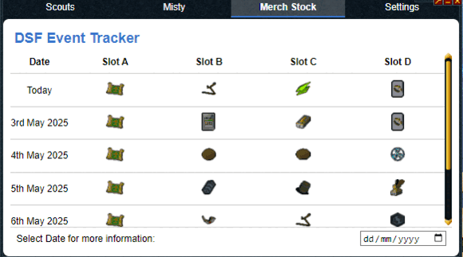

# Deep Sea Fishing Event Tracker

This event tracker is an Alt1 Toolkit app for the Deep Sea Fishing Hub in RuneScape. It was built mainly to help our team of volunteer staff and scouters find event calls quicker and organize scouting efforts. Throughout development, many additional features were added to improve the overall experience of scouting worlds and communicating with everyone who is actively helping.  

📢 Join our official [Deep Sea Fishing Discord Server](https://discord.gg/whirlpooldnd) for more info, coordination, and support.

### ✨ Key Features
- 📋 A fully event-driven **Scouting Tab** to view all active events and your previous history.
- 🛒 View the current day (and any other day) of **Merchant Stock** at a glance.
  - 🔮 Next 7 days of stock available immediately.
  - 🗓 Select any date to view stock in more detail.
- 🌍 Real-time world tracking via Misty NPC.
- 🔁 **Discord Relay:**
  - Event calls are relayed to and from Discord for a wider reach.
  - Both Alt1 and Discord are kept in sync.

## 🛠 How to Use

After installing the app, every user will have basic access to the tracker. Some specific actions (like advanced scouting tools) require you to validate your Discord ID — this is mainly for active volunteers.  

🔧 Head to the **Settings Tab** to personalize your experience. Helpful ℹ️ info buttons are available throughout the app.

### 🎣 Fishing
While on the Deep Sea Fishing platform, keep the app open or minimized. Any events that appear on your current world will automatically be detected and shared with the community.

### 🔍 Scouting
If you’re actively scouting for the Travelling Merchant or other events:
- Stand next to **Misty** NPC.
- Ask her when the world was last active.
- This will automatically update that world’s timer for everyone using the app — making it easier to plan and coordinate scouting.

## 📌 Requirements & 💡 Recommendations

If the **Alt1 AfkWarden** app works for you, this app will too — it uses the same chatbox OCR system.

📌 **Required:**
- Game Messages must be set to either **Filtered** or **On**.
- Your chatbox must be **clear of buff bars**, dialogue boxes, or other overlapping UI elements.

💡 **Recommended:**
- Ensure your chatbox is wide enough for accurate OCR detection.
- Right-click the Alt1 Toolkit icon in RuneScape and enable **"Show current world"**.

## 📥 Installation

To install the DSF Event Tracker, open one of the following URLs in your browser:

- [alt1://addapp/https://www.dsfeventtracker.com/appconfig.json](alt1://addapp/https://www.dsfeventtracker.com/appconfig.json)
- [https://www.dsfeventtracker.com/](https://www.dsfeventtracker.com/)

When prompted during installation, **enable all 3 permissions**. The app will not function properly without them.
